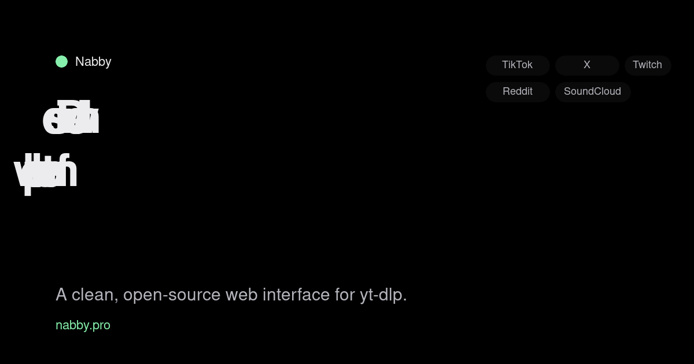

# Nabby

**A free, open-source, self-hostable web UI for [yt-dlp](https://github.com/yt-dlp/yt-dlp).** Paste a link from TikTok, Facebook, X (Twitter), Reddit, Vimeo, SoundCloud, Twitch, or any of the thousands of other sites yt-dlp supports; pick a format; download the file.

Live at **[nabby.pro](https://nabby.pro)**.



## What it is

Nabby is a lightweight web interface for yt-dlp. It is designed for journalists, researchers, archivists, educators, and self-hosters who need a simple way to save public media before it disappears. Nabby:

- Supports the full catalog of yt-dlp when self-hosted; the hosted instance (nabby.pro) uses a conservative allowlist.
- Does **not** support YouTube (by design — see [`/about`](https://nabby.pro/about) and [`/faq`](https://nabby.pro/faq)).
- Does **not** host, index, or redistribute files. Downloads are deleted from the server one hour after they complete.
- Does **not** require an account.
- Is built with Flask + yt-dlp + ffmpeg, with a subtle Three.js point-cloud background in the UI.

## Features

- Paste one URL or many (one per line).
- Format and quality selection up to 1080p, or audio-only (mp3, m4a, opus, wav).
- Live progress via Server-Sent Events.
- Transient storage — 1-hour TTL cleanup thread.
- Minimal, dark, no-JS-framework UI (~80 KB).
- Hostable behind Cloudflare Tunnel (no open ports) or nginx + Let's Encrypt.

## Install

### Docker Compose (recommended)

```yaml
services:
  nabby:
    build: .
    container_name: nabby
    restart: unless-stopped
    ports:
      - "5000:5000"
    volumes:
      - ./downloads:/app/downloads
```

```sh
git clone https://github.com/NJPTeam/nabby
cd nabby
docker compose up -d
# → http://localhost:5000
```

### Docker (single command)

```sh
docker build -t nabby .
docker run -d --name nabby -p 5000:5000 -v $(pwd)/downloads:/app/downloads nabby
```

### From source

```sh
git clone https://github.com/NJPTeam/nabby
cd nabby
./run.sh
# → http://localhost:5000
```

The first run creates a venv and installs Flask + yt-dlp. You'll also need `ffmpeg` on `$PATH`.

## Production deploy

See the [deployment guide](https://nabby.pro/about#how-it-works) on nabby.pro. In short:

- **Behind Cloudflare Tunnel** (recommended, zero open ports): `cloudflared service install <TOKEN>` on the host, add a public hostname `yoursite.com → http://localhost:5000`.
- **Behind nginx + Let's Encrypt**: `proxy_pass http://127.0.0.1:5000;` with `proxy_buffering off;` (required for SSE progress) and `proxy_read_timeout 3600s;`.
- Run under systemd using `gunicorn --workers 2 --threads 4 --worker-class gthread`.

## Configure

Supported sites are allowlisted in `app.py` via `ALLOWED_HOSTS`. Extend the set to add sites. Removing the allowlist entirely is possible but not recommended for a public instance; keep in mind that yt-dlp itself supports [thousands of sites](https://github.com/yt-dlp/yt-dlp/blob/master/supportedsites.md).

Downloads are stored in `./downloads/<job_id>/` and swept every 5 minutes by a background thread; `JOB_TTL_SECONDS` (default 3600) controls lifetime.

## How it compares

- **vs yt-dlp CLI** — Nabby is a web form. The CLI is strictly more flexible; Nabby exists for the 90% of downloads where the CLI's power is overkill. See [Nabby vs yt-dlp CLI](https://nabby.pro/compare/nabby-vs-ytdlp-cli).
- **vs MeTube** — Nabby is paste-and-grab with no persistent state. MeTube is a queue-based archive. See [Nabby vs MeTube](https://nabby.pro/compare/nabby-vs-metube).
- **vs youtubedl-material** — ytdl-material is a full media-library product with accounts and subscriptions. Nabby is a one-shot tool. See [Nabby vs youtubedl-material](https://nabby.pro/compare/nabby-vs-youtubedl-material).
- **vs cobalt.tools** — cobalt is a hosted service with its own extractors. Nabby is self-hostable and runs on yt-dlp. See [Nabby vs cobalt](https://nabby.pro/compare/nabby-vs-cobalt).
- **vs yt-dlp-webui** — yt-dlp-webui is a feature-rich Go dashboard with job management. Nabby is minimal Python/Flask. See [Nabby vs yt-dlp-webui](https://nabby.pro/compare/nabby-vs-ytdlp-webui).

## Status

Nabby is new (October 2026). The hosted instance at nabby.pro is a reference deployment; most users should self-host.

## Contributing

Issues and PRs welcome. See [`CONTRIBUTING.md`](CONTRIBUTING.md).

## License

MIT. See [`LICENSE`](LICENSE).

## Legal

- [Terms of Service](https://nabby.pro/terms)
- [Privacy Policy](https://nabby.pro/privacy)
- [DMCA Policy](https://nabby.pro/dmca)
- Contact: `njpteam.official@gmail.com`
